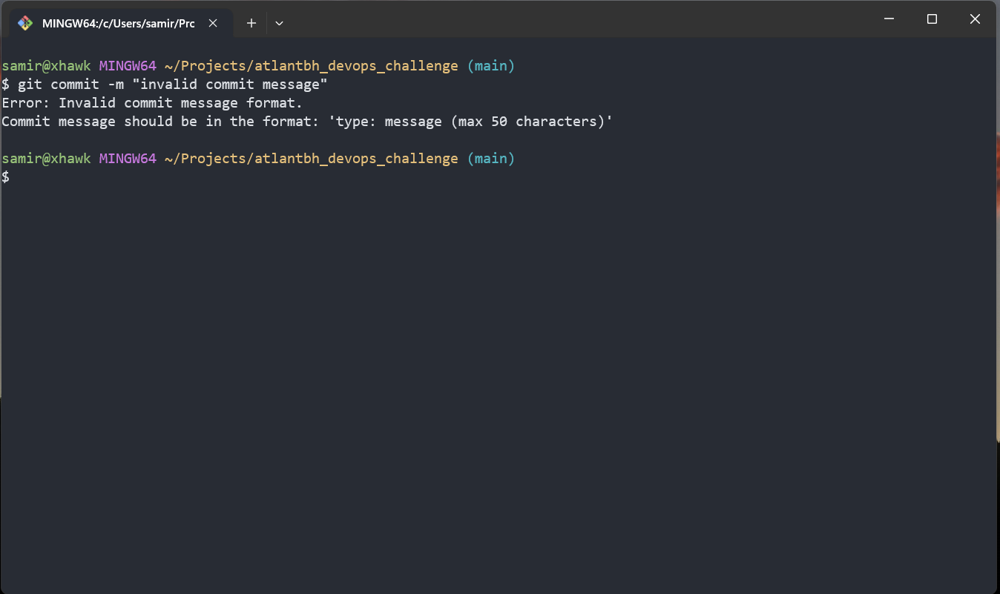
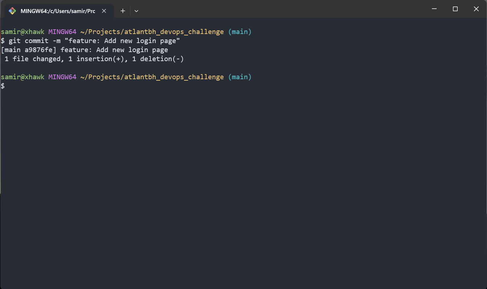

# Atlantbh Devops Challenge

## Task Description:

In collaborative software development projects, maintaining a standardized commit message format is crucial for clarity and organization. This repository demonstrates how to enforce a standardized commit message format using Git hooks. The commit messages in this project are required to follow the format:

Where `<type>` can be one of the following:

- `feature` (new feature)
- `fix` (bug fix)
- `refactor` (refactoring code)
- `wip` (work in progress - commits to be pushed later)

The commit message should also not exceed 50 characters.

## How to Implement Git Hooks

To implement this commit message format using Git hooks, I made this steps:

1.  **Create/Clone the Repository:**

2.  **Navigate to the `.git/hooks` Directory:**

3.  **Create the `commit-msg` Hook:**

    - Copy the `commit-msg.sample` file as `commit-msg` (remove the `.sample` extension).
    - Open the `commit-msg` file in a text editor and create the hook script.

    <br>
    
    ```bash
    #!/bin/sh

    COMMIT_MSG_FILE=$1
    COMMIT_MSG=$(cat $COMMIT_MSG_FILE)

    # Regular expression pattern for valid commit messages
    PATTERN="^(feature|fix|refactor|wip): .{1,50}$"

    if ! [[ $COMMIT_MSG =~ $PATTERN ]]; then
    echo "Error: Invalid commit message format."
    echo "Commit message should be in the format: 'type: message (max 50 characters)'"
    exit 1
    fi
    ```

    - Save the file and make it executable: `chmod +x commit-msg`

4.  **Test the Hook:**
    Try making a commit with an invalid commit message format to ensure that the hook prevents it.

    

5.  **Commit with Correct Format:**
    Use one of the specified commit types followed by a colon and a message (up to 50 characters) for valid commits.

    

6.  **Push Changes to GitHub:**
    After testing the hook locally, I pushed the changes to the GitHub repository.
